# Dr. Kevin Neuro-Advisory Platform

## User Personas & Journey Maps

---

## User Personas

### Persona 1: The Tech Entrepreneur

```mermaid
graph TD
    A[Marcus Chen, 42] --> B[Profile]
    B --> C[Net Worth: $180M]
    B --> D[Industry: Tech/SaaS]
    B --> E[Location: San Francisco]

    A --> F[Goals]
    F --> G[Maintain peak performance]
    F --> H[Optimize decision-making]
    F --> I[Manage stress & burnout]
    F --> J[Scale company to IPO]

    A --> K[Pain Points]
    K --> L[4-5 hours sleep/night]
    K --> M[Constant context switching]
    K --> N[High-stakes decisions daily]
    K --> O[No time for traditional coaching]

    A --> P[Tech Savvy]
    P --> Q[Early adopter]
    P --> R[Uses: Apple Watch, Oura Ring]
    P --> S[Values: Data, efficiency, privacy]

    style A fill:#c9a961
    style B fill:#4a7c9e
    style F fill:#4a7c9e
    style K fill:#f44336
    style P fill:#4caf50
```

**Demographics:**

- Age: 42
- Net Worth: $180M
- Industry: Technology/SaaS
- Location: San Francisco, CA
- Family: Married, 2 children

**Professional Life:**

- CEO of Series C startup (400 employees)
- Managing rapid growth and scaling challenges
- Board meetings, investor relations, team leadership
- 70-80 hour work weeks
- Frequent travel (10-15 days/month)

**Lifestyle:**

- Wakes: 5:30 AM
- Sleep: 4-5 hours/night
- Exercise: Sporadic (wants to be consistent)
- Diet: Inconsistent, often skips meals
- Stress Level: 8/10

**Technology Usage:**

- iPhone Pro, Apple Watch Ultra, Oura Ring
- Uses: Slack, Zoom, Notion, Calendar obsessively
- Tries wellness apps but abandons them
- Values automation and efficiency

**Motivations:**

- Stay sharp for critical business decisions
- Avoid burnout before IPO
- Optimize cognitive performance
- Maintain competitive edge
- Be present for family

**Frustrations:**

- Generic wellness advice doesn't fit his lifestyle
- No time for hour-long coaching sessions
- Privacy concerns with consumer apps
- Wants data-driven, measurable results
- Needs 24/7 support across time zones

**Quote:**

> "I make decisions worth millions every day. I can't afford to be operating at 70% capacity. I need something that works with my schedule, not against it."

---

### Persona 2: The Hedge Fund Manager

```mermaid
graph TD
    A[Victoria Sterling, 51] --> B[Profile]
    B --> C[Net Worth: $320M]
    B --> D[Industry: Finance/Investments]
    B --> E[Location: New York City]

    A --> F[Goals]
    F --> G[Sustain high performance]
    F --> H[Manage market stress]
    F --> I[Maintain mental clarity]
    F --> J[Longevity & health]

    A --> K[Pain Points]
    K --> L[Market volatility stress]
    K --> M[Information overload]
    K --> N[Sleep disruption]
    K --> O[Aging concerns]

    A --> P[Preferences]
    P --> Q[Discretion & privacy]
    P --> R[Evidence-based solutions]
    P --> S[Premium service expectations]
    P --> T[Proven track record]

    style A fill:#c9a961
    style B fill:#4a7c9e
    style F fill:#4a7c9e
    style K fill:#f44336
    style P fill:#4caf50
```

**Demographics:**

- Age: 51
- Net Worth: $320M
- Industry: Hedge Fund Management
- Location: New York City (+ Hamptons)
- Family: Divorced, 3 adult children

**Professional Life:**

- Managing Partner, $2.8B AUM hedge fund
- 25+ years in finance
- High-pressure decision-making environment
- Market opens 9:30 AM - must be sharp
- Global markets = 24/7 monitoring

**Lifestyle:**

- Wakes: 5:00 AM (market prep)
- Sleep: 6 hours (interrupted)
- Exercise: Personal trainer 3x/week, yoga
- Diet: Careful, works with nutritionist
- Stress Level: 7/10 (spikes during volatility)

**Technology Usage:**

- iPhone, Bloomberg Terminal, multiple monitors
- Moderate tech adoption (needs proven solutions)
- Values human expertise over pure automation
- Privacy is paramount
- Uses Whoop for fitness tracking

**Motivations:**

- Maintain edge in competitive market
- Manage stress during volatile periods
- Cognitive longevity (planning 20+ more years)
- Outperform competitors
- Protect mental health

**Frustrations:**

- Generic executive coaching lacks finance context
- Meditation apps feel too consumer-grade
- Needs immediate support during market crises
- Wants discretion (can't share sensitive info)
- Previous solutions didn't deliver results

**Quote:**

> "In my world, a moment of hesitation or brain fog can cost millions. I need cognitive optimization that understands the stakes and delivers measurable results."

---

### Persona 3: The Family Office Principal

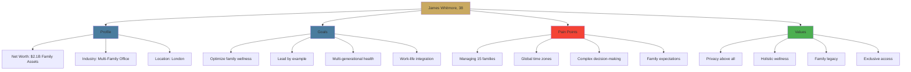

**Demographics:**

- Age: 38
- Net Worth: $2.1B (family assets under management)
- Industry: Multi-Family Office Principal
- Location: London (travels extensively)
- Family: Married, 1 child, expecting second

**Professional Life:**

- Managing 15 UHNW families
- Investment strategy, estate planning, lifestyle management
- Board positions on 8 companies
- Philanthropic initiatives
- Global travel 20+ days/month

**Lifestyle:**

- Wakes: 6:00 AM
- Sleep: 6-7 hours
- Exercise: Running, tennis, golf
- Diet: Balanced, enjoys fine dining
- Stress Level: 6/10 (well-managed)

**Technology Usage:**

- iPhone, iPad, multiple devices
- Early adopter of premium solutions
- Values integration and seamlessness
- Uses: Apple Health, Oura Ring, Eight Sleep
- Expects white-glove service

**Motivations:**

- Set wellness example for client families
- Optimize performance across time zones
- Maintain work-life balance
- Longevity and quality of life
- Access to best-in-class solutions

**Frustrations:**

- Existing solutions too consumer-focused
- Lack of privacy in wellness platforms
- Generic advice doesn't fit UHNW lifestyle
- Wants solution for entire family
- Needs concierge-level support

**Quote:**

> "I advise families on optimizing their wealth. I need the same level of sophistication for optimizing our cognitive health and performance."

---

### Persona 4: The Serial Entrepreneur

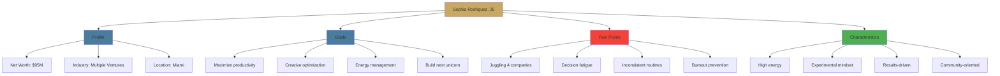

**Demographics:**

- Age: 35
- Net Worth: $95M (3 exits, 4 active companies)
- Industry: Tech, E-commerce, Real Estate
- Location: Miami, FL
- Family: Single, no children

**Professional Life:**

- CEO of 2 companies, board member of 2 others
- Building 4th startup (AI/ML space)
- Angel investor (25 companies)
- Frequent speaker and thought leader
- Constantly networking and dealmaking

**Lifestyle:**

- Wakes: Variable (5:30-7:00 AM)
- Sleep: 5-6 hours
- Exercise: CrossFit, biking, swimming
- Diet: Experimenter (keto, fasting, supplements)
- Stress Level: 7/10 (thrives on it)

**Technology Usage:**

- Latest iPhone, Apple Watch, AirPods Pro
- Super early adopter
- Uses: Notion, Superhuman, Loom, 20+ productivity apps
- Tracks everything (biohacker mentality)
- Active on social media

**Motivations:**

- Maximize output and creativity
- Stay ahead of competition
- Optimize every aspect of performance
- Build lasting legacy
- Share knowledge with community

**Frustrations:**

- Too many tools, needs consolidation
- Generic advice doesn't match intensity
- Wants cutting-edge, not mainstream
- Needs flexibility for chaotic schedule
- Previous coaches couldn't keep up

**Quote:**

> "I'm building the future. I need cognitive tools that are as advanced as the technology I'm creating. Show me the data, show me the results."

---

### Persona 5: The C-Suite Executive

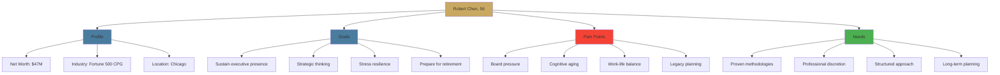

**Demographics:**

- Age: 56
- Net Worth: $47M
- Industry: Fortune 500 Consumer Packaged Goods
- Location: Chicago, IL
- Family: Married 28 years, 3 children (grown)

**Professional Life:**

- Chief Operating Officer
- 30+ years with company
- Managing 15,000+ employees
- Board presentations and investor relations
- Considering retirement in 5-7 years

**Lifestyle:**

- Wakes: 6:00 AM
- Sleep: 6-7 hours
- Exercise: Golf, walking, gym 2x/week
- Diet: Healthy, occasional indulgence
- Stress Level: 6/10

**Technology Usage:**

- iPhone, iPad, laptop
- Moderate adopter (needs proven solutions)
- Uses: Outlook, Teams, basic fitness apps
- Values simplicity and reliability
- Prefers human interaction

**Motivations:**

- Maintain sharp strategic thinking
- Manage board and stakeholder pressure
- Cognitive health for retirement years
- Leave strong legacy
- Support executive team

**Frustrations:**

- Feeling cognitive decline
- Generic wellness programs at work
- Wants personalized, not one-size-fits-all
- Needs discretion (can't show weakness)
- Previous solutions felt gimmicky

**Quote:**

> "I've spent 30 years building this company. I need to stay sharp for the final stretch and ensure I'm mentally fit for the next chapter of my life."

---

## User Journey Maps

### Journey 1: Marcus (Tech Entrepreneur) - First 90 Days

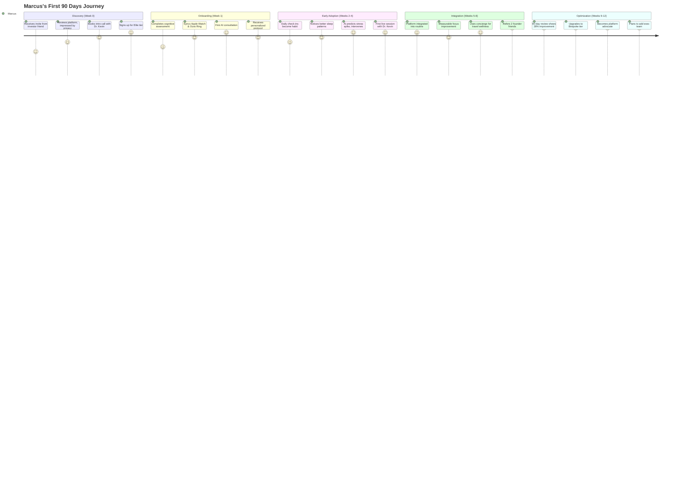

---

### Journey 2: Victoria (Hedge Fund Manager) - Crisis Support

```mermaid
journey
    title Victoria's Market Crisis Journey
    section Normal Day (Morning)
      Morning routine with platform: 8: Victoria
      Reviews cognitive performance metrics: 8: Victoria
      AI suggests optimal meeting schedule: 9: Victoria
    section Crisis Hits (10:00 AM)
      Market drops 5% unexpectedly: 3: Victoria
      Stress levels spike dramatically: 2: Victoria
      Platform detects elevated heart rate: 5: Victoria
      AI sends immediate calming protocol: 6: Victoria
    section Active Support (10:15 AM)
      Follows breathing exercises: 7: Victoria
      Receives focus-enhancing suggestions: 8: Victoria
      Concierge checks in via text: 8: Victoria
      Makes critical trading decisions: 9: Victoria
    section Recovery (Afternoon)
      Platform guides stress recovery: 8: Victoria
      Schedules emergency Dr. Kevin session: 9: Victoria
      Reviews decision quality metrics: 8: Victoria
    section Reflection (Evening)
      Debrief session with Dr. Kevin: 9: Victoria
      Updates crisis protocols: 9: Victoria
      Grateful for real-time support: 10: Victoria
```

---

### Journey 3: James (Family Office) - Family Wellness Program

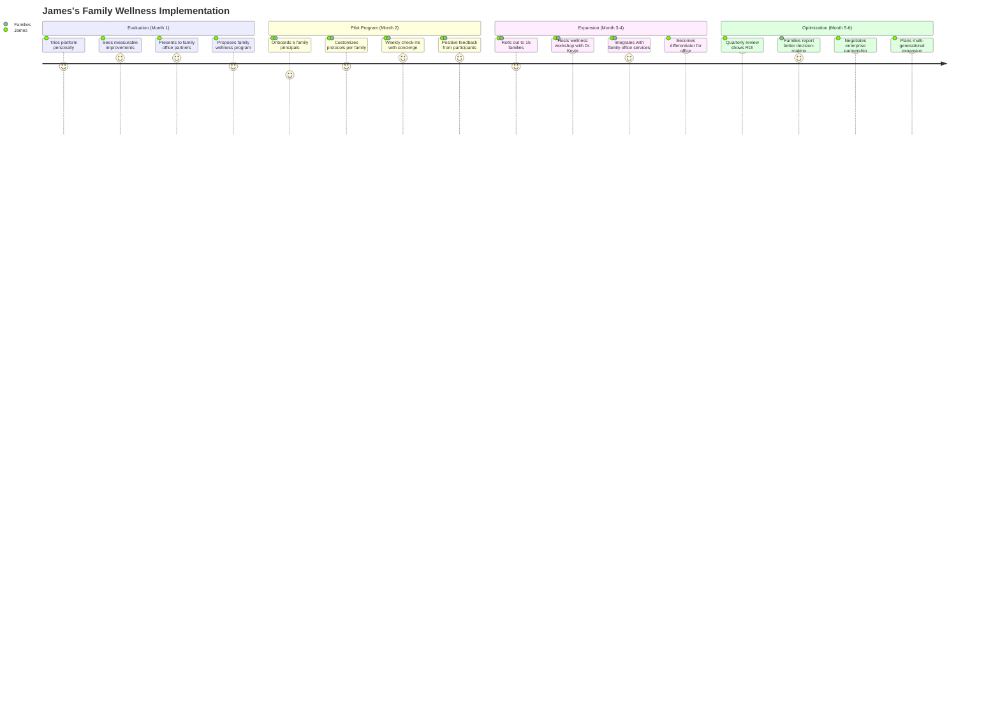

---

### Journey 4: Sophia (Serial Entrepreneur) - Daily Power User

```mermaid
journey
    title Sophia's Typical Day with Platform
    section Morning (5:30 AM)
      Wakes, checks overnight insights: 8: Sophia
      Reviews AI-optimized daily schedule: 9: Sophia
      Morning workout with biometric tracking: 9: Sophia
      Breakfast with cognitive nutrition tips: 8: Sophia
    section Peak Performance (9 AM - 12 PM)
      Tackles high-stakes decisions: 9: Sophia
      AI suggests optimal break timing: 9: Sophia
      Quick meditation via platform: 8: Sophia
      Investor pitch with confidence: 10: Sophia
    section Afternoon (12 PM - 5 PM)
      Platform detects energy dip: 7: Sophia
      Suggests strategic break and snack: 8: Sophia
      Creative brainstorm session: 9: Sophia
      AI consultation on team challenge: 9: Sophia
    section Evening (5 PM - 9 PM)
      Networking event prep tips: 8: Sophia
      Social energy optimization: 9: Sophia
      Wind-down protocol activated: 8: Sophia
    section Night (9 PM+)
      Sleep optimization routine: 9: Sophia
      Reviews day's cognitive performance: 8: Sophia
      Sets intentions for tomorrow: 9: Sophia
```

---

### Journey 5: Robert (C-Suite) - Long-term Transformation

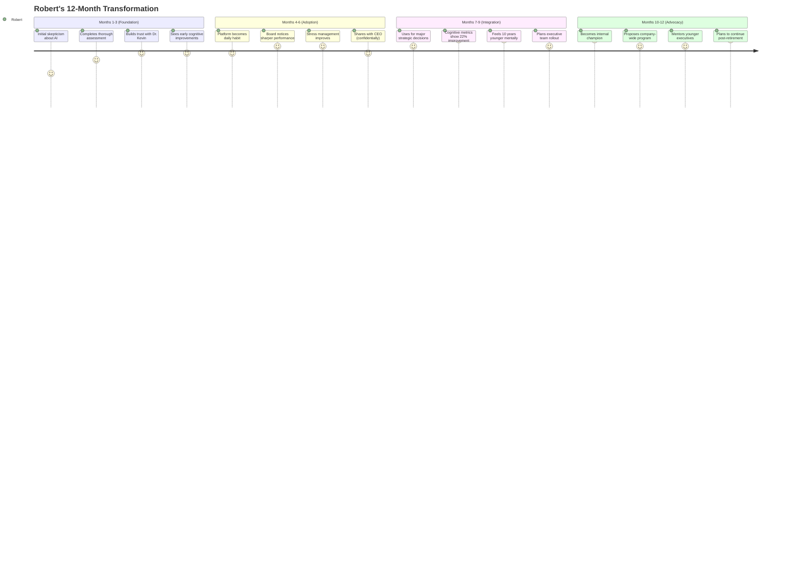

---

## Comparative User Journey: Onboarding Experience

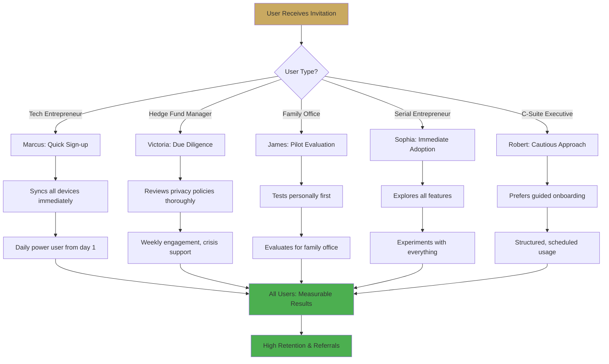

---

## Cross-Persona Feature Usage Heatmap

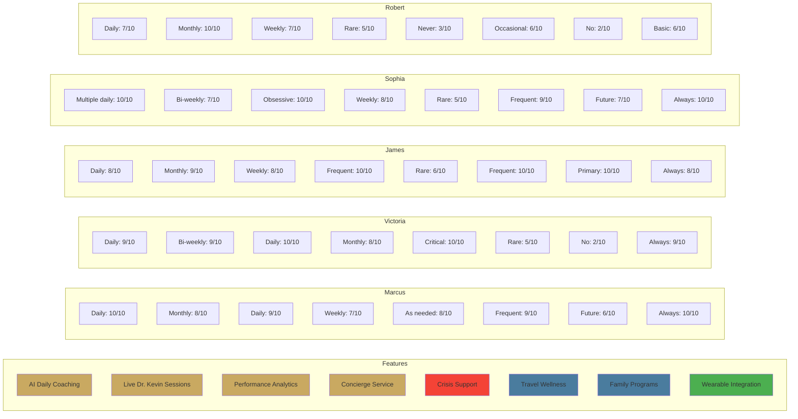

---

## Emotional Journey Arc

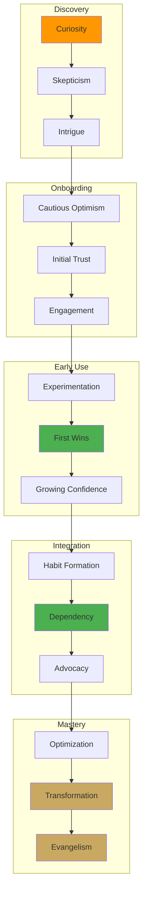

---

## Persona-Specific Pain Points & Solutions

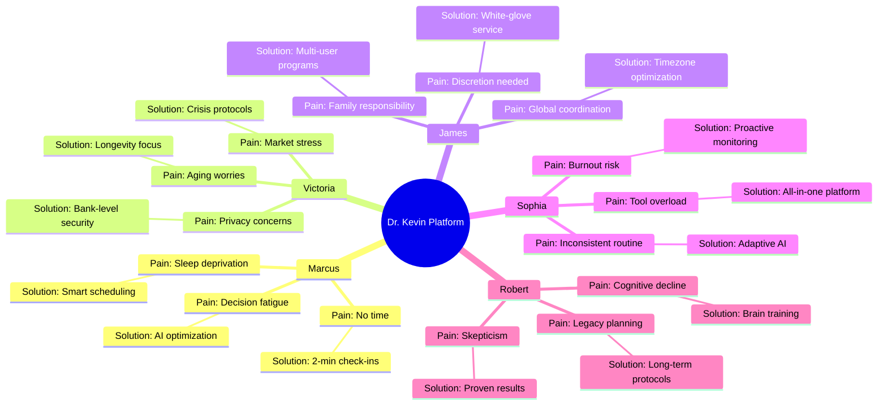

---

## User Lifecycle Journey

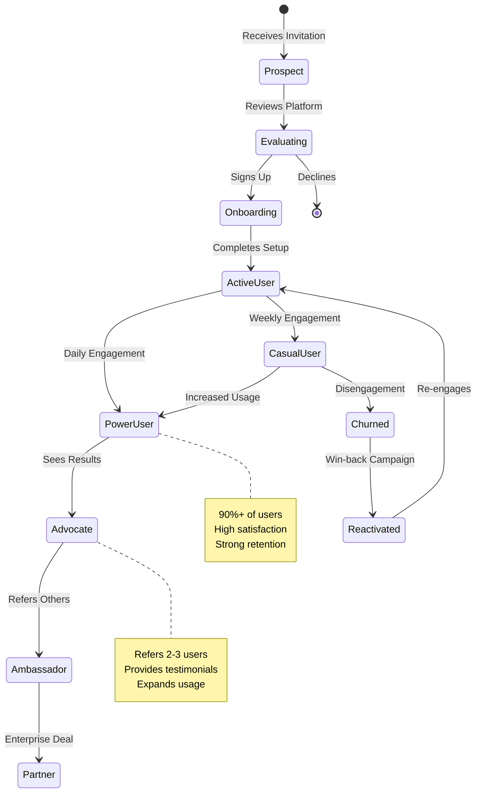

---

## Touchpoint Mapping Across Personas

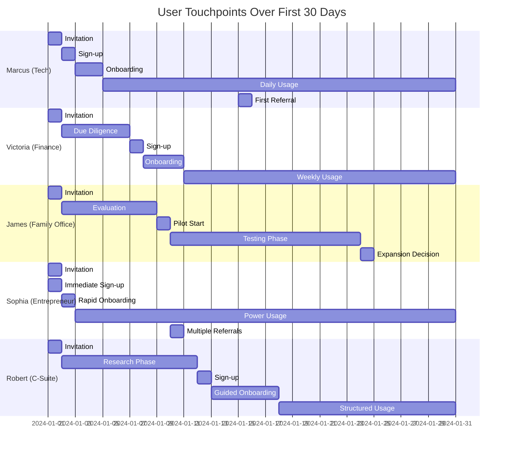

---

_These personas and journeys represent our core UHNW user base and their diverse needs, preferences, and usage patterns._

_Last Updated: December 2025_
